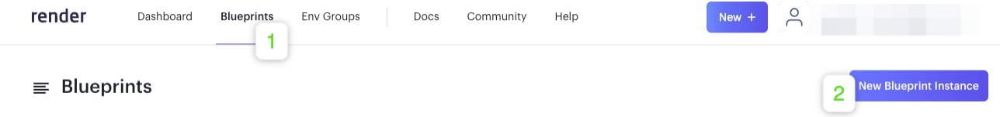
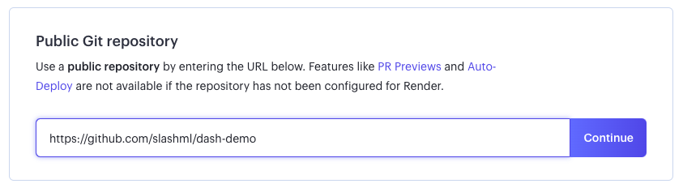
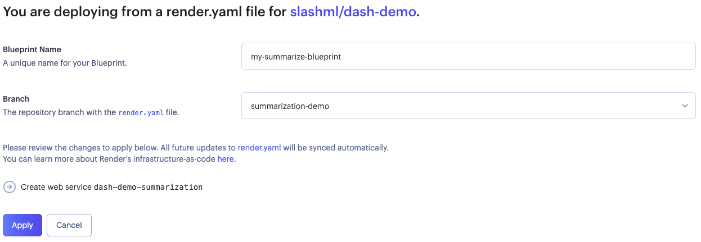
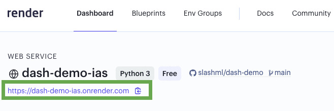

# SlashML Dash Demos

This repo contains [Dash](https://dash.plotly.com/) demos that shows basic use-cases for our service.

## Summarization Demo

Details here

## Text-to-Speech Demo

Details here

## Speech-to-Text Demo

Details here

## Deployment ([Render](https://render.com/))

To deploy this demo on [Render](https://render.com/), you first need to login or create an account on [Render](https://render.com/) and navigate to your Render [Dashboard](https://dashboard.render.com/).

Then, naviagate to `Blueprints` > `New Blueprint Instance`

Under `Public Git repository`, set the URL to `https://github.com/slashml/dash-demo`

`Blueprint Name`: Give your Blueprint a unique name. 

`Branch`: Each demo is on a different branch. Select the demo that you want to deploy from the dropdown

Once you have set `Blueprint Name` and `Branch`, press `Apply`

Wait for the blueprint to deploy the web-service, which you can see in the Dashboard.

Navigate to [Dashboard](https://dashboard.render.com/) and click on your newly created service.

You can find the URL of the deployed web-service at the top of the page.

