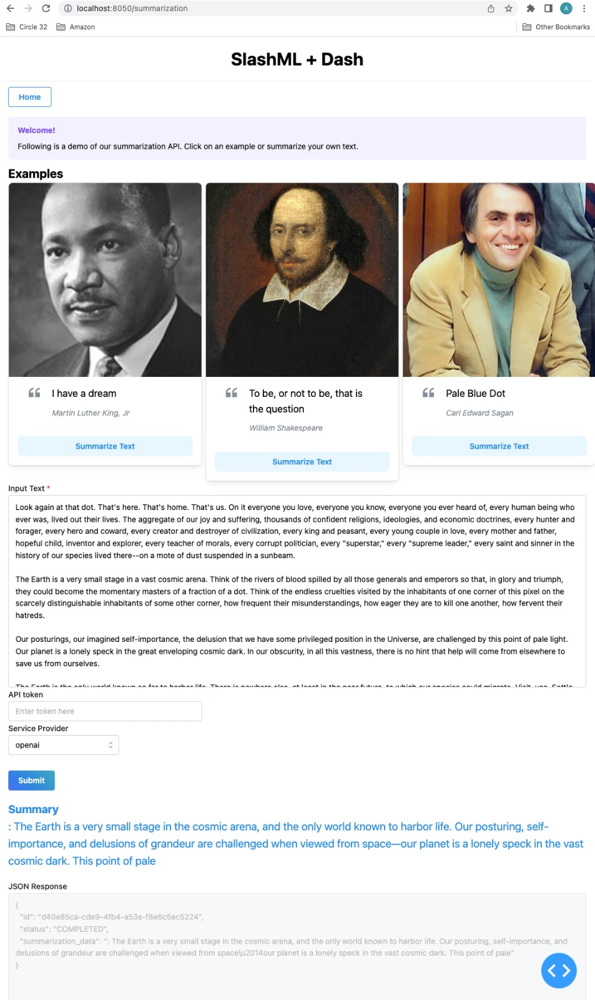

# SlashML Dash Demos

This repo contains [Dash](https://dash.plotly.com/) demos that shows basic use-cases for our service.

## Summarization Demo

### Deploy Locally

```
$ cd examples/
$ python -m summarization.app
```


### Deploy on cloud

You can also deploy it to cloud for free using [Render](https://www.render.com)

# TODO: Add render deployment details here


## Demo Snapshot

Following is a snapshot of how the demo looks like.


